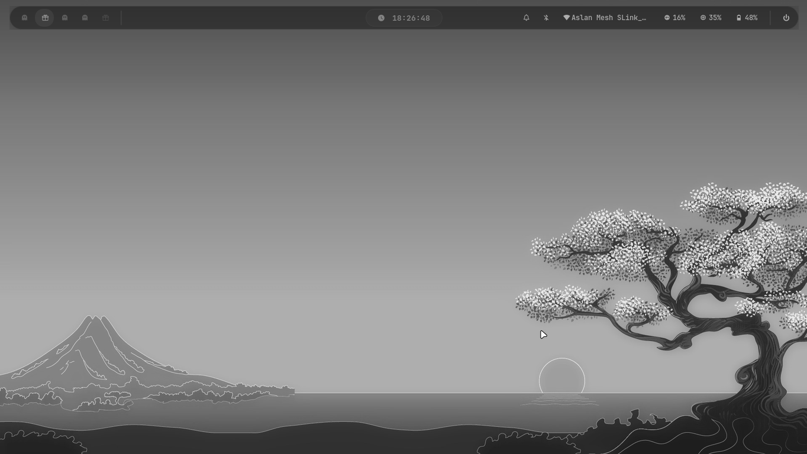

# 👻 ghost — Niri Wayland Compositor Config

A clean, modular configuration for the [Niri](https://github.com/YaLTeR/niri) scrollable-tiling Wayland compositor, with Waybar, Kitty, Pywal, Rofi, and swww.

---

## 📸 Preview



> *Catppuccin-themed Waybar · Dynamic wallpaper with Pywal color extraction · Bibata Modern Ice cursor*

---

## 📁 Structure

```
~/.config/niri/
├── config.kdl          # Root config (includes all modules)
├── input.kdl           # Keyboard, touchpad, mouse, cursor
├── output.kdl          # Monitor output (eDP-1, scale 1.0)
├── layout.kdl          # Gaps, focus-ring, shadow, border
├── autostart.kdl       # Waybar, swww, waypaper, wallpaper-random
├── screenshot.kdl      # Screenshot output path
├── binds.kdl           # All keybindings
├── keybinds.txt        # Keybinding list (used by show-binds)
└── window-rules.kdl    # Window rules (rounded corners, etc.)
```

```
~/.config/
├── kitty/
│   └── kitty.conf              # Transparent terminal, JetBrains Mono
├── waybar/
│   ├── config.jsonc            # Waybar modules and layout
│   └── style.css               # Catppuccin theme
└── wal/
    └── templates/
        └── colors-rofi-pywal.rasi  # Pywal color template for Rofi
```

```
~/.local/bin/
├── wallpaper-random    # Set random wallpaper + trigger Pywal
└── show-binds.sh       # Display keybindings in Rofi
```

---

## ⌨️ Keybindings

| Key | Action |
|-----|--------|
| `Mod + Return` | Launch terminal (Kitty) |
| `Mod + D` | App launcher (Fuzzel) |
| `Mod + Q` | Close focused window |
| `Mod + F` | Maximize column |
| `Mod + Shift + F` | Toggle fullscreen |
| `Mod + O` | Overview |
| `Mod + H / J / K / L` | Move focus (vim-style) |
| `Mod + 1..9` | Switch to workspace |
| `Mod + Shift + W` | Random wallpaper |
| `Mod + Shift + B` | Show keybindings |
| `Mod + Shift + E` | Exit Niri |

> `Mod` = Super key

---

## 🧩 Components

| Component | Version / Notes |
|-----------|----------------|
| **Niri** | Scrollable-tiling Wayland compositor |
| **Waybar** | Status bar · Catppuccin theme |
| **Kitty** | Terminal · transparent · JetBrains Mono |
| **swww** | Wallpaper daemon with smooth transitions |
| **Pywal** | Auto color scheme from wallpaper |
| **Fuzzel** | Application launcher |
| **Rofi** | Keybinding viewer · Pywal colors |
| **Cursor** | Bibata Modern Ice |

---

## 🚀 Installation

### 1. Install dependencies

```bash
# Arch Linux
paru -S niri waybar kitty swww python-pywal fuzzel rofi-wayland \
        bibata-cursor-theme-bin ttf-jetbrains-mono-nerd
```

### 2. Clone this config

```bash
git clone https://github.com/Inope83/ghost ~/.config/niri
```

### 3. Install scripts

```bash
cp scripts/wallpaper-random ~/.local/bin/wallpaper-random
cp scripts/show-binds.sh    ~/.local/bin/show-binds.sh
chmod +x ~/.local/bin/wallpaper-random ~/.local/bin/show-binds.sh
```

### 4. Add shell aliases (optional)

```bash
# ~/.zshrc or ~/.bashrc
alias nr="niri msg action reload-config"
alias nrv="niri validate"
alias wb="systemctl --user restart waybar"
```

### 5. Start Niri

```bash
niri-session
```

---

## 🖼️ Wallpapers

Place `.jpg` or `.png` files in `~/Pictures/Wallpapers/`.  
Press `Mod + Shift + W` to pick a random one and regenerate your color scheme.

---

## 📝 License

MIT — do whatever you want with it.

---

*Built with [Niri](https://github.com/YaLTeR/niri) · Inspired by the ricing community*
